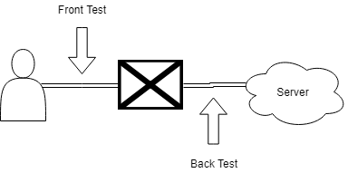
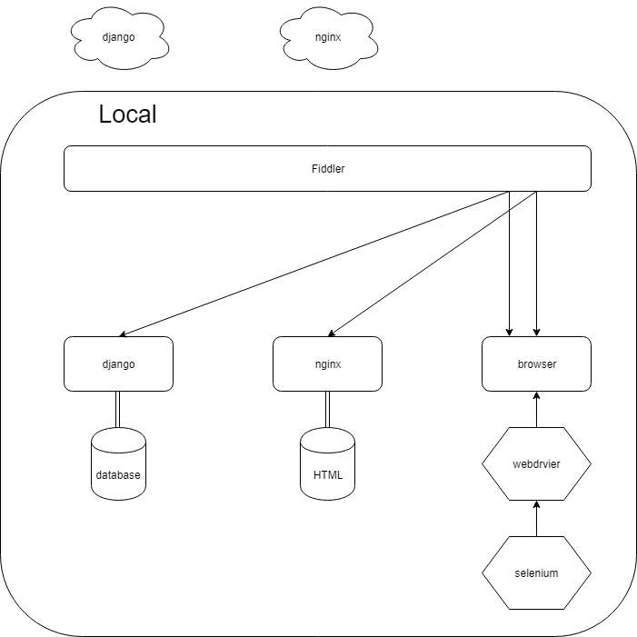
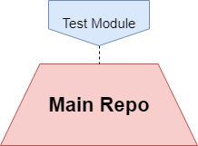
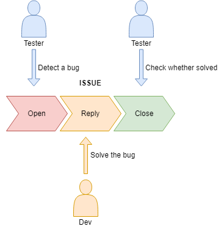

# 测试点

选择的测试点有两个
* 一个是用户与浏览器（客户端）之间的节点，也就是模拟用户对浏览器的操作与获取的响应来进行测试，称之为“前测试点”(Front Test Point)。
* 一个是浏览器（客户端）与服务器之间的节点，也就是模拟客户端来向服务器收发HTTP请求来进行测试，称之为“后测试点”(Back Test Point)。

我们没有在服务器内部设置测试点，也就是说我们将服务器视为一个黑盒。

# 测试阶段目标(Roadmap)
1. alpha阶段：
    * 搭建自动测试环境
        * 在后测试点，实现测试逻辑和测试数据分离，为持续测试做基础。
        * 在前测试点，实现自动化测试，为持续测试做基础。
    * 检验各功能在理想条件下是否如规格书所描述地运行。
        * 理想条件：完全符合预期的简单输入。
2. beta阶段：
    * 兼容性检查：测试在不同终端、不同平台、不同浏览器上的运行情况。
        * 不同终端：mobile、PC
        * 不同平台：mac OS, windows, android, ios
        * 不同浏览器：chrome, edge, firefox
    * 安全性检查：使用攻击性的测试思路，挖掘安全性漏洞。
        * 泄露敏感信息的代码、包、数据、接口。
        * 可以被利用的接口。
        * 在被攻破后的可执行的应急措施。
3. gamma阶段：
    * 易用性检查：检验是否存在不合理的设计/不易用的情景。
        * 良好的响应性。
        * 快捷的操作。
        * 直观的反馈。
        * 需求的满足程度。
    * 鲁棒性检查：检验边界条件，在非异常的极端/特殊情况下各功能是否如规格书所描述地运行。
        * 在后测试点，构建复杂测试样例。
        * 在前测试点，构造usercase模拟一套用户的操作，并在此基础上实现并行测试。
            * 并行测试：构建多个usercase，随机伪并发执行，检验是否运作正常。

各阶段出口条件：
1. alpha：在理想条件下运行符合规格描述。
2. beta：通过安全性、兼容性检查。并通过alpha阶段的回归测试。
3. gamma：通过鲁棒性、易用性检查。并通过alpha, beta阶段的回归测试。

# 测试工具
测试模块完全使用Django的django.test模块。

服务器端对两个测试点使用不同的做法：
* 对于前测试点，因为需要在js代码中指定后端的域名+端口，所以无法使用django.test模块初始化时提供的具有随机端口的django测试服务器。所以我们每次进行前测试的时候，都需要手动在本地建立一个测试服务器，然后手动刷新一下它的数据库，将测试数据填充进去。
* 对于后测试点，直接使用django的fixture系统来填充测试数据库。

客户端对两个测试点采用不同的工具来模拟：
* 对于前测试点，使用Selenium模拟客户端。
* 对于后测试点，使用Django原生的Client模拟客户端。

# 前测试点
## 设计模式
使用[Page Object](https://github.com/SeleniumHQ/selenium/wiki/PageObjects)作为Design Pattern。即，将每个页面作为一个类，将该页面提供的服务作为接口。每个类内部自己维护该页面的元素定位符。

## 测试环境的搭建

使用Fiddler对域名和端口进行重映射，将对远端服务器的请求转换为对本地服务器的请求。
通过使用openssl自己签个证书以及使用werkzeug_debugger_runserver实现本机支持https。详见[自签证书说明](self_ca.md)。

### 本地劫持腾讯验证码服务器
因为我们使用了腾讯验证码作为安全措施，但这个措施会导致自动测试的不可行。解决方案是本地架设了一台假的腾讯验证码服务器，然后利用Fiddler劫持一切发送给真的腾讯验证码服务器上的请求给假的上面去，从而确保自动化测试的可行性。详见[劫持腾讯验证码服务器](rob_tx.md).

端口情况：
* nginx服务器，开在80端口，负责分发前端代码文件。
* django服务器，开在随机用户端口，负责后端接口的供应。
* faketx服务器，开在3668端口，负责假装自己是腾讯的验证码服务器
* testcase进程，开在随机用户端口，负责调用selenium，然后selenium打开浏览器，请求nginx服务器获取网页文件，再通过ajax请求django服务器获取后端数据。

## 代码覆盖率计算方法
使用jscover，启用local-storage来支持跨页面的插桩记录存取。详见。

基本流程如下：
1. 使用jscover对前端js文件插桩。
2. 修改测试代码，使得每个WebDriver被销毁前会保存插桩记录。
3. 合并插桩记录，得到覆盖率报告。

不过需要注意的是，仅仅只对**js文件**插桩，裸写在html文件中的js代码不会被纳入覆盖率的统计中。

## 测试思路
细的来说：
1. 检查用户需要知道的信息的元素是否出现在页面上。
5. 检查页面上是否出现了不该出现的元素。（例如已经登录的用户却在界面上找到了登录按钮）
2. 检查用户操作是否得到预期的响应。
3. 检查页面跳转逻辑是否如逾期执行。
4. 检查异常处理是否合理完善。

粗的来说：
1. 检查典型用户的一套操作流程是否能正常执行，并且用户是否能够的得到他们想要的信息。
2. 检查用户的异常操作是否会得到合理的报错，并能顺利恢复现场。

## 测试样例总览
此处不将列出详细的测试用例内容，只列出每族测试样例的概述。
* [+]号表示还未完成。
* [@]号表示该测试样例是由一串线性的操作序列表示的。

-------

* 页面跳转逻辑检查，第一级表示跳转起点，第二级表示跳转终点，第三级表示跳转方式
    * 首页 
        * 登录
            * 登录按钮
        * 注册
            * 注册按钮
        * 个人信息
            * 个人信息按钮
        * 搜索
            * 搜索课程按钮
            * 搜索框内回车
    * 搜索
        * 首页
            * 首页按钮
        * 登录
            * 登录按钮
        * 注册
            * 注册按钮
        * 个人信息
            * 个人信息按钮
        * 课程信息
            * 课程名称
    * 课程信息
        * 首页
            * 首页按钮
        * 登录
            * 登录按钮
        * 注册
            * 注册按钮
        * 个人信息
            * 个人信息按钮
        * [+]搜索
        * 评论
            * 添加评论按钮
    * 评论
        * 首页
            * 首页按钮
        * 登录
            * 登录按钮
        * 注册
            * 注册按钮
        * 课程信息
            * 提交评论按钮
    * 注册
        * 首页
            * 首页按钮
        * 登录
            * 登录按钮
            * 确认注册按钮
    * 登录
        * 首页
            * 首页按钮
            * 确认登录
        * 注册
            * 注册按钮
    * 个人信息
        * 首页
            * 首页按钮
        * 个人信息
            * 个人信息按钮
            * 确认修改按钮
* 功能检查
    * 登录功能
        * 是否能登录到一个已注册用户上
        * 是否不能登录到一个未注册用户上
        * 在登陆后是否在各场景下都能正确反映登录用户信息
            * 个人信息页面是否是登录用户的信息
            * 评论后该评论的作者是否是登录用户
    * 注册功能
        * 是否不能注册一个已注册用户
        * 是否能注册一个未注册用户
    * 注销功能
        * 在各页面是否能正常注销
            * 首页
            * 搜索
            * 课程信息
            * 评论
            * 个人信息
    * 搜索功能
        * [+]是否能通过课程信息页面的一些条项搜索对应的内容
        * 在不指定学院、课程名称的情况下
            * 不存在课程时，能否告知不存在课程
            * 存在课程时，能否给出所有课程
        * 在只指定学院的情况下
            * 不存在该学院的课程时，能否告知不存在课程
            * 存在该学院的课程时，能否给出该学院的所有课程
        * 在只指定课程名称的情况下
            * 目标课程不存在时，能否告知不存在
            * 目标课程存在时，能否找到目标课程
                * 只有一个课程匹配课程名称
                * [+]有多个课程匹配课程名称
        * 在课程名称、学院都被指定的情况下
            * 当该学院中不存在匹配课程时，能否告知不存在
                * [+]所有课程都不匹配该课程名称
                * 存在匹配的课程，但不属于该学院
            * 当该学院中存在匹配课程时，能否给出匹配的课程
                * 所有课程中只有这一个课程匹配课程名称
                * [+]所有课程中有多个课程匹配该课程，但只有其中几个课程属于该学院
                * [+]所有课程中有多个课程匹配该课程，且都属于该学院
    * 切页功能，针对课程信息页面、搜索页面（栏是指每个切页的基本显示元素，例如课程信息页面的栏是指非热门评论的评论）[@]
        * 除了最后一页，各页是否都有规定的每页最大栏数
        * 各页显示的栏的内容是否正确
        * 切页按钮显示检查
            * 第一页和最后一页的切页按钮是否被显示
                * 页数大于等于2
                * [+]页数为1时，应只显示一个
            * 当前页码小于等于4时
                * [+]最大页码小于等于6时
                    * 切页按钮是否全部显示
                    * 前省略、后省略是否都不显示
                * 最大页码大于6时
                    * 第一页到第五页的切页按钮是否被显示
                    * 第六页到倒数第二页的切页按钮是否不被显示
                    * 前省略是否不显示
                    * 后省略是否显示
            * 当前页码大于等于最大页码-3，且大于4时
                * [+]最大页码小于等于6时
                    * 切页按钮是否全部显示
                    * 前省略、后省略是否都不显示
                * 最大页码大于6时
                    * 倒数第五页到倒数第一页的切页按钮是否被显示
                    * 第二页到倒数第六页的切页按钮是否不被显示
                    * 前省略是否显示
                    * 后省略是否不显示
            * 当前页码大于4，且小于最大页码-3时
                * [当前页码-2, 当前页码+2]页是否显示
                * [2, 当前页码-3]页是否不被显示
                * [当前页码+2, 最大页码-1]页是否不被显示
                * 前省略、后省略是否都被显示
    * 评论发表功能
        * 是否能在对应课程下给出相应的评论
            * 这个好像和上面的登录功能里面的评论重了，一起做了
        * 子评论
            * 已有的子评论是否能正常显示
            * 能否添加新的子评论
    * 个人信息修改功能
        * 能否修改角色、性别、个人介绍
        * 能否修改头像
            * [+]注意，目前确认头像是否修改的方法仅为检查url是否变更，而并没有检查图像内容。
    * 评论赞踩功能
        * [+]对热门评论
        * 对普通评论[@]
            * 评论的总评价显示是否正常
                * 总评价为0
                * 总评价为正
                * 总评价为负
            * 赞按钮、踩按钮的显示在个人对评论的评价转化时是否正常
                * 由无评价转为赞时
                * 由无评价转为踩时
                * 由赞转为无评价时
                * 由赞转为踩时
                * 由踩转为无评价时
                * 由踩转为赞时
            * 评论的总评价在个人对评论产生评价时的数值变化是否正常
                * 同上
* [+]页面冗余检查
* 兼容性检查
    * [+]页面长宽比兼容性检查：在不同长宽比的浏览器界面下是否都能有良好响应
    * 浏览器兼容性检查：在不同浏览器中是否都能有良好响应
        * chrome, firefox, edge
        * [+]国产浏览器
    * [+]操作系统兼容性检查
    * [+]硬件平台兼容性检查
* [+]易用性检查
    * 在登录/注册信息不完整/错误的情况下能否给出有效提示引导用户完善信息
    * 在评论超字数的情况下能否给出有效提示引导用户
    * 各功能的响应速度是否合理

# 后测试点
## 前提
我们默认一切规格规定的渠道的用户输入都已在前端被充分检验正确性（例如，注册时用户名、密码是否符合格式），故在后端不做任何相关测试。

## 代码覆盖率计算方法
使用python的coverage获取代码覆盖率。仅计算rateMyCoure目录下的代码。

## 测试思路
1. 检查各接口是否如规格描述地正确响应。
2. 检查是否存在不该暴露给用户的资源也暴露了。
3. 使用代码覆盖率，检查是否存在无用代码。

## 测试样例总览
此处不将列出详细的测试用例内容，只列出每族测试样例的概述。
* [+]号表示还未完成。

---

* 标准检查：对于非常良好的输入的情况下，各接口是否给出正确输出。
* [+]边界检查：对于满足传入需求，但处在边界的输入，各接口是否能给出正确输出。
* 安全性检查：是否存在能在无权限的情况下获取敏感信息的接口，或在无限制的情况下占用过多服务器资源的接口。
    * 详见安全分析报告书，应该在总库的doc目录下。
* [+]异常检查：在出现异常情况时，服务器的响应情况。
    * 不在计划内。
* [+]压力测试
    * 不在计划内。

## 测试样例构造思路
这里只将给出部分比较抽象的测试样例的构造思路。

### 标准检查-同质合并
注意到有大量的接口都是Create, Update, Search这类对Model的操作，考虑它们的同质性。

观察可知同质性：
* Create, Update: 都是发送Post请求，并将修改的Model信息附加在payload上。收到回复后检查回复请求中的状态码来确定是否成功，最后检查数据库中是否有符合要求的Model被添加/更新。

* Search: 都是发送Get请求，并将期望的Model信息附加在payload上。收到回复后检查回复请求中的状态码来确定是否成功，最后检查回复请求中body的信息是否符合预期。

也就是说大多数的测试样例之间的区别仅仅在于
* 请求的url
* 请求的payload
* 检查的Model/Body内容

故而对于同质的接口可以使用统一的逻辑进行测试。详见[test_auto_back.md](test_auto_back.md)。

# 测试代码管理

测试代码和服务器代码不在一个库中，它独立地作为一个库存在。但主库（服务器代码所在库）会将测试代码作为submodule引入。

这么做的目的是为了使得任何时候都能从主库的任意分支获取测试代码的任何分支的任何commit，避免了因为测试需要而对主库代码的合并/切出作出要求。

# 测试样例管理
我们使用了django提供的tag来管理需要特殊对待的测试样例，使得在测试时可以选取测试样例执行。目前使用的tag包括:
* 无

在我的不断努力下，已经没有需要特殊对待的测试样例了。

# bug管理

使用issue来进行bug管理。流程如下：
1. 测试人员发现bug，发布issue，将其assign给相关人士。
2. 相关人士处理bug，发布commit，回复测试人员。
3. 测试人员检查是否确实处理，并进行回归测试。
    1. 若一切正常，关闭issue。
    2. 若出现问题，继续讨论解决。

# 测试数据
使用`test/fixture.json`作为前测试点测试数据，`test/back_fixture.json`作为后测试点测试数据。

fixture可通过以下指令(back_fixtrue.json也是类似的指令)从数据库中导出：

    python test/test_manage.py dumpdata -e contenttypes -e admin -e auth.Permission --natural-foreign --indent=2 > test/fixture.json

通过以下指令加载（注意是追加式的加载）：

    python test/test_manage.py loaddata test/fixture.json

## 后测试点测试时的测试数据载入
该工作完全交由django进行，我们在BackBasicTestCase中指定类属性fixtures，随后每次执行后测试时，django会自动根据该fixture创建一个测试数据库，随后都在该测试数据库上进行测试，直到测试结束，测试数据库自动销毁。

一般地，可以通过执行该命令进行后测试：
`python test/test_manage.py test test/back`

## 前测试点测试时的测试数据载入
这部分工作比较麻烦。因为前测试点需要一个具有固定端口的django服务器，而django自动创建的测试服务器是具有随机端口的。所以我们只能使用在测试开始前就启动的具有固定端口的django服务器的数据库作为测试数据库。

为此我们构建了一个专门的TestRunner: ReloadTestRunner。该runner会在每次测试开始前自动地刷新数据库，并载入测试数据到数据库中。原理是简单地调用django内核中的flush和loaddata Command。

一般地，可以通过执行该命令进行前测试：
`python test/test_manage.py test test/front --testrunner=test.reload_runner.ReloadTestRunner`

可以发现，和后测试的差别仅在于指定了test runner。事实上，后测试也可以指定这么一条，反正也没啥影响。

# 测试环境下的秘钥管理
因为我们的后端采用的方法是使用环境变量保存秘钥，然后在加载settings时读取秘钥，所以我们需要为测试环境也创造这些秘钥。

做法很简单，因为测试环境有一个统一的python入口：test_manage.py，所以我们在test_manage.py中引入这几个秘钥变量就可以了。

# 测试矩阵
Platform   | Browser 
:-:        | :-: 
PC         | Chrome
Mobile     | Firefox
|          | Edge

# 测试环境下的django配置
## 缓存管理
因为我们的项目使用了django提供的cache_page的FileCache来实现缓存机制，而测试环境下存在频繁而大量的数据变更，所以缓存机制对测试而言是个很麻烦的东西。因此我们不能使用FileCache，而是使用MemoryCache。

最后的做法是在test_settings.py中覆盖掉CACHES，转而使用LocMemCache，这样我们每次重启django服务器的时候缓存就会被清空。

## CSRF
测试环境下不知道为啥CSRF会出问题，我也没时间去研究明白到底为啥，所以测试环境下我就直接关掉它了。

# 测试结果
详见[test_result.md](test_result.md)
