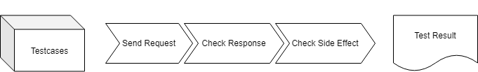

# 类层次结构
    BackBasicTestCase
        - BackPostCheckDBTC
            -- BackCreateTC
            -- BackUpdateTC
        - BackGetCheckBodyTC
            -- BackSearchTC

1. 第一层BackBasicTestcase引入fixture，为所有测试准备数据库基础
2. 第二层BackPostCheckDBTC和BackGetCheckBodyTC封装测试逻辑。
3. 第三层为实际的测试样例。

# 测试流程

# 这么做的利弊
利：
* 合并了同质的测试逻辑，大幅度地减少了代码量。

弊：
* 对于特殊的接口的测试会显得不太灵活，因为得再从BackBasicTestCase派生出来新的类来进行测试。
