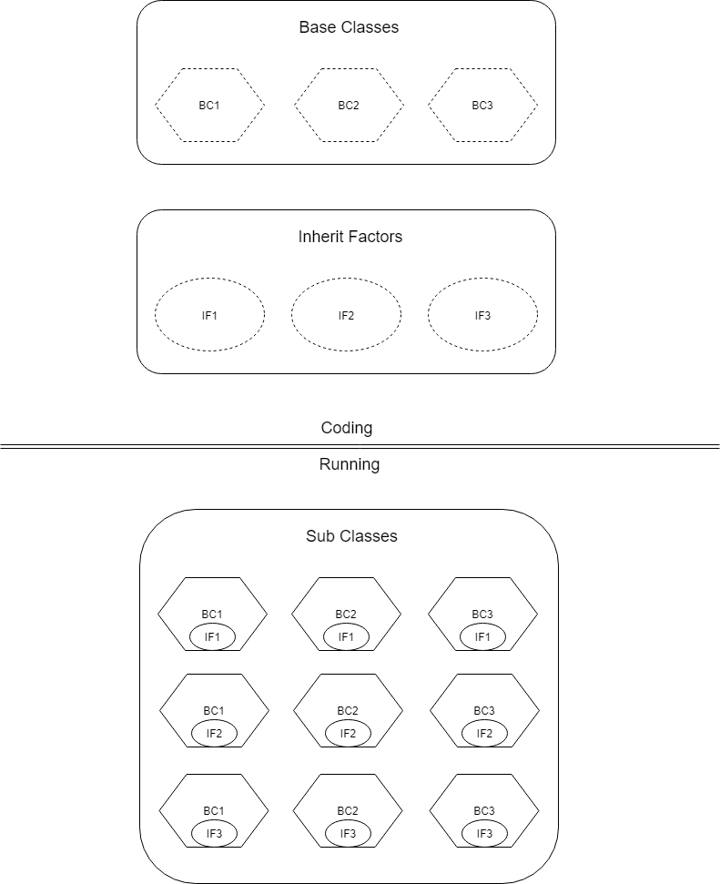

本文档介绍了test_factory、template、driver_factor的设计初衷，以及如何使用它们构建自动化兼容性测试框架。

# 问题背景
观察使用selenium进行自动化测试的过程，我们可以将它概述为：

* 启动测试进程，在该进程中构建WebDriver
* 启动浏览器进程，将它与WebDriver建立连接
* 使用WebDriver向浏览器发送请求从而达到控制的效果

在实际的代码中，我们所需要做的只有构建WebDriver和通过WebDriver提供的接口控制浏览器这两件事情。对于后者，既然我们的目标是各浏览器的兼容，那么对于所有的浏览器，调用的WebDriver的接口都应该是一致的。所以这部分测试代码应该被共享，唯一的区别应该是构建WebDriver的过程。

我们是基于django的测试框架，django的测试框架的本质是使用python的unittest。python的unittest是基于TestCase这个类的，也就是一个类一族测试样例。上文中提到的两件实际代码中我们做的事情就是以TestCase为单位被编写的。每当一个TestCase类被初始化时，我们就为它构建一个WebDriver，然后在这个类中的每个测试样例中通过WebDriver来控制浏览器。这就导出一个结论：一个类一个WebDriver、一套控制逻辑。

注意到我们希望控制逻辑在各浏览器的测试中是相同的，但各浏览器使用的WebDriver是不同的。

这就很自然地会想到类的继承，一个基类写控制逻辑，然后每个浏览器派生这个基类，重载构建WebDriver的逻辑。但要注意到，我们有大量的TestCase类，如果每个TestCase都需要为它编写一族继承类的代码，而且这些代码还几乎一模一样，仅仅只是因为代码逻辑上需要所以才写的话，那太累了。

所以，我们最后的需求是：有一族基类(控制逻辑)，还有一族函数(构建WebDriver)，如果将派生看成乘的话，我们就是想要他两的笛卡尔积。也就是每个基类都有一族派生类，每个派生类对应于给基类添加那一族函数中的一个函数。

# 核心概念：动态继承

核心的概念是使用python类对象的思想在模块被加载时进行动态继承。这需要用到[types module](https://docs.python.org/3/library/types.html)，python提供了该模块使得动态构建类对象变得简单。我们只需简单地调用[types.new_class](https://docs.python.org/3/library/types.html#types.new_class)函数，并在参数中指定基类就可以动态地从该基类中继承一个新类。

在继承得到一个新类后我们需要为它添加它的继承因子，也就是给它添加方法。这也非常简单，在new_class的exec_body中指定就行了。新的方法会在new_class执行中被添加到被添加到新类的__dict__中，也就是命名空间中。

    >>> import types
    >>> def f(self):
        print("F")

        
    >>> A = types.new_class("A", exec_body=lambda ns: ns.update({"nf":f}))
    >>> a = A()
    >>> a.nf()
    F
    >>> A.__dict__
    mappingproxy({'nf': <function f at 0x00000227B0AD1C80>, '__module__': 'types', '__dict__': <attribute '__dict__' of 'A' objects>, '__weakref__': <attribute '__weakref__' of 'A' objects>, '__doc__': None})

对于我们的问题，也就只需要两个循环，一个循环遍历基类，一个循环遍历继承因子，然后在循环中构建新类即可。

# 基类遍历问题
不过遍历基类本身也是一个问题。回归我们的原来的问题，我们的基类是分布在各文件中的大量TC(TestCase，下略)，且这些TC之间本身就存在继承结构。方便起见，我们将基类的遍历做成一个根据继承关系的递归过程。使用所有TC的共同基类FrontBasicTC作为递归的根，然后递归遍历所有子类。

这里又会涉及一个问题，上一章中提到了我们会动态继承得到新类，这样如果递归遍历子类的话就会导致无穷递归问题了。所以我们在动态继承时要往新类的命名空间中加上一个标记，当在递归遍历时发现这个标记就停止继续对这个类进行递归。

## 子类识别问题
注意到我们需要访问FrontBasicTC的所有子类，我们使用的是__subclasses__方法，若一个py文件没有被执行过(也就是import过)的话，那么该方法就不会识别到该py文件中的子类。所以我们需要在test_factory.py的一开始就将所有基类都在的目录template下的所有模块都import进来。为此我们将template作为一个包，然后在它的__init__.py文件中添加了__all__方法，用于`from template import *`。

# 新类识别问题
如前文所述，我们本质上使用的是python的unittest作为测试框架。虽然我们能够在一个模块中动态继承新类了，但还未将这些新类添加到这个模块test_factory的命名空间中，这就导致python的UnitTestRunner识别不到这些新类。

为此我们在test_factory中将__dir__和__getattr__重载，前者返回这个模块的属性的名字的列表，后者根据名字获取属性对象。我们用生成的新类作为test_factory模块的属性，在__dir__和__getattr__中对应返回。

注：这里的做法可能不太好，因为是针对UnitTestRunner所做的欺骗性工作，当python的unittest发生改变时可能会失效，而且还会导致无法读取test_factory的类似__name__这些元属性。

# 继承因子遍历问题
这本来不应该是个问题，但我为了更无脑方便地开发，做了一些小trick。因为现在所使用的所有继承因子都是类方法，所以我做成了读入继承因子们所在的模块，然后遍历该模块的属性，对于为类方法的属性，将其看做继承因子进行操作。

这样的好处是不用维护有哪些继承因子的列表，简单地加上本来就要加的@classmethod装饰器就可以自动被识别。

# 简而言之
这一章面向只是想写测试样例的人。

## 添加测试样例
打开template目录，写新的继承自FrontBasicTC的测试类，然后把这个测试类所在的模块加进template目录下的__init__.py的__all__中。

## 添加浏览器
打开dirver_tcfactor.py，在里面追加一个类方法，该方法初始化cls.driver为对应的浏览器的WebDriver。